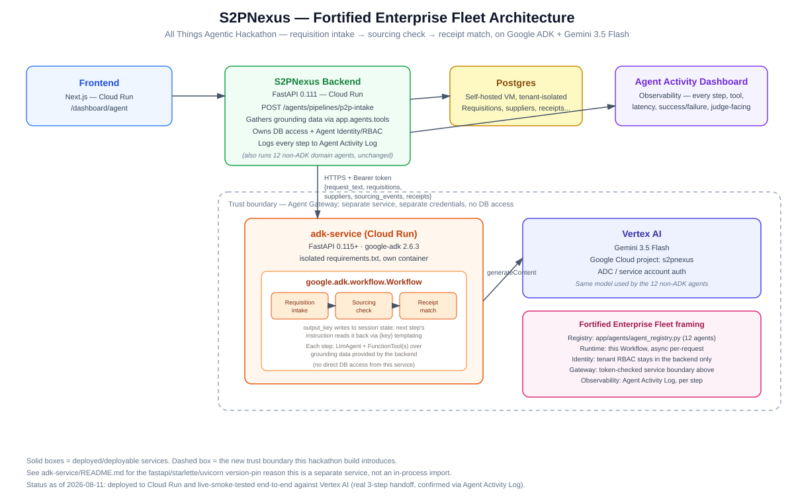
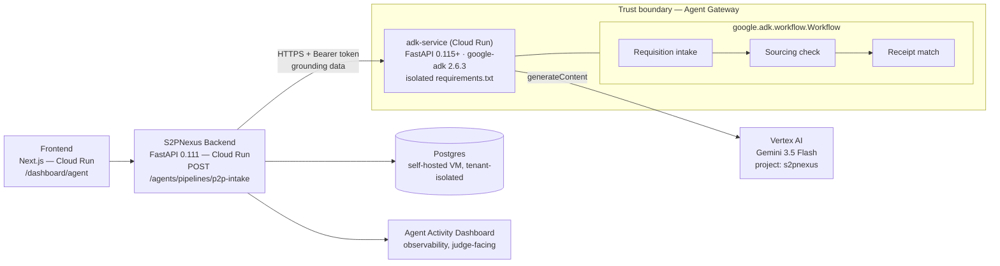

# S2PNexus — Fortified Enterprise Fleet Architecture

Architecture diagram for the All Things Agentic Hackathon submission. See
`AGENTIC_HACKATHON_SUBMISSION_PLAN.md` for the full plan and
`../adk-service/README.md` for the service-split rationale in detail.

(Static image at `docs/images/agentic_hackathon_architecture.svg`, for uploading
directly to the Devpost submission form. Mermaid source below for anyone
reading this in the repo instead.)

## Fortified Enterprise Fleet framing

| Track ask | Where it lives |
|---|---|
| Agent Registry | `backend/app/agents/agent_registry.py` — 12 cataloged domain agents (unchanged by this build) |
| Agent Runtime | `adk-service`'s `Workflow`, async per-request; existing workflow engine for the rest of S2PNexus |
| Agent Identity | Tenant RBAC stays entirely in `S2PNexus Backend` — `adk-service` never touches Postgres or tenant credentials |
| Agent Gateway | The HTTPS + Bearer-token boundary between the backend and `adk-service`, plus Cloud Run IAM (`--no-allow-unauthenticated`) |
| Model Armor | **Gap, disclosed** — no prompt-injection/PII-leak guardrail in this build |
| Agent Observability | Agent Activity Log — every ADK step logged individually (`agent_name`, tool data, latency, success), same dashboard as the other 12 agents |
| Google Cloud infra | Cloud Run (3 services: frontend, backend, adk-service) |
| Google Agent Framework | `google-adk` 2.6.3, `google.adk.workflow.Workflow` |
| Gemini 3.5+ | `gemini-3.5-flash` via Vertex AI, both in `adk-service` and the pre-existing 12 agents |

## Status (2026-08-11)

Built and unit-tested (6 tests passing across both services, in isolated venvs). **Not
yet deployed to Cloud Run and not yet exercised against live Vertex AI** — the dev
environment this was built in has no route to `googleapis.com`. See
`adk-service/README.md`'s Deploy section for the next step.
