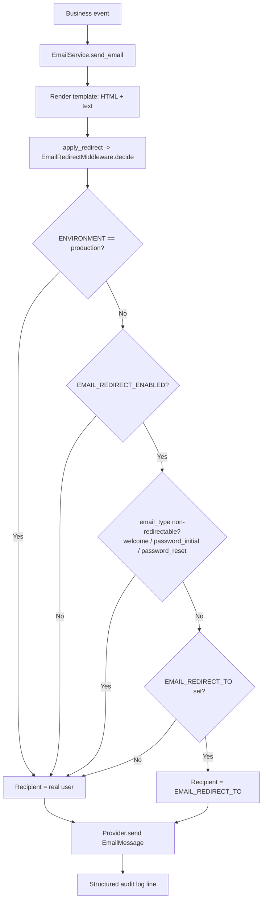

# S2PNexus — Email Redirect Feature
## Functional & Technical Specification (v1.0)

| | |
|---|---|
| **Feature** | Email Redirect (DEV / QA / Sandbox) |
| **Status** | Specified + Reference Implementation |
| **Date** | 2026-08-01 |
| **Stack** | FastAPI (async) · Pydantic Settings · SMTP (Gmail) · Next.js (admin UI) |
| **Backend location** | `backend/app/services/email_service.py`, `backend/app/middleware/email_redirect.py`, `backend/app/core/config.py` |
| **Templates** | `backend/app/templates/email/*.html` |
| **Tests** | `tests/unit/test_email_redirect.py`, `tests/unit/test_email_service.py` |

---

## 1. Executive Summary

S2PNexus generates system emails as part of its Source-to-Pay workflows (order
confirmations, approval/workflow notifications, generic system notifications,
plus user-critical onboarding and security mail). In **development, QA and
sandbox** environments we must never spam real users or suppliers with
test/duplicate mail.

The **Email Redirect** feature provides a configurable, audited pipeline that
**redirects every *redirectable* system email to a single catch-all inbox**
(`EMAIL_REDIRECT_TO`) when `EMAIL_REDIRECT_ENABLED=true`, while guaranteeing that
**user-critical mail (welcome, initial password, password reset) always reaches
the real recipient**. Redirection is **hard-disabled in production** by a
two-layer safety interlock (config-load validation + runtime middleware check),
and every send/redirect is written to a structured audit log.

---

## 2. Functional Specification

### 2.1 Feature summary

> When `EMAIL_REDIRECT_ENABLED=true`, all system-generated emails are redirected
> to `EMAIL_REDIRECT_TO`. This applies **only** to DEV / QA / Sandbox
> environments. The system logs every redirection event for audit.

1. A single flag turns the feature on/off.
2. Redirection is scoped by **email type**, not by caller — callers cannot
   accidentally bypass the pipeline.
3. The environment is enforced by a **safety interlock**: production never
   redirects, even if misconfigured.
4. Every decision (redirected *or* direct) is recorded for audit.

### 2.2 Email classification

**Emails that are ALWAYS redirected** (in DEV/QA/Sandbox when enabled):

| Email type | `EmailType` value | Example sender |
|---|---|---|
| Order Confirmation | `order.confirmation` | `send_order_confirmation_email(...)` |
| Generic system notification | `system.notification` | `send_email(email_type="system.notification", ...)` |
| Workflow notification | `workflow.notification` | workflow engine step `notification` |
| Approval notification | `approval.notification` | approval event fan-out |

**Emails that are NEVER redirected** (always delivered to the real user):

| Email type | `EmailType` value | Why |
|---|---|---|
| Welcome (new user onboarding) | `user.welcome` | The user cannot log in until they act on it |
| Password Email (initial password) | `user.password_initial` | Contains the only way to first authenticate |
| Password Reset | `user.password_reset` | Account-security critical, time-sensitive |

**Classification rule:** an email is non-redirectable iff its `email_type` is a
member of the `NON_REDIRECTABLE_EMAIL_TYPES` frozenset. Any other type is
redirectable. Adding a new email type is *fail-safe*: unknown types default to
**redirectable** (so no real user is accidentally emailed in dev).

### 2.3 Environment behavior matrix

| `ENVIRONMENT` | `EMAIL_REDIRECT_ENABLED` | Result |
|---|---|---|
| `development` | `false` | All email → real recipients |
| `development` | `true` | Redirectable → `EMAIL_REDIRECT_TO`; welcome/password/reset → real user |
| `staging` / QA | `false` | All email → real recipients |
| `staging` / QA | `true` | Redirectable → `EMAIL_REDIRECT_TO`; user-critical → real user |
| `production` | `false` | All email → real recipients |
| `production` | `true` | **App refuses to start** (config interlock) |

> Note on naming: the config model currently admits `development | staging |
> production`. "QA/Sandbox" maps to `staging`. If a dedicated `sandbox` value is
> wanted later, add it to the `ENVIRONMENT` regex — the redirect logic keys off
> "not production", so no other change is required.

### 2.4 User stories

- **As an engineer**, I can enable `EMAIL_REDIRECT_ENABLED=true` in my `.env` and
  be confident no real supplier/customer is emailed from my dev box.
- **As an engineer**, I can verify a new user is *still* emailed directly even
  when redirect is on (onboarding must work end-to-end).
- **As an admin**, I can see every redirect/direct decision in the structured
  log for QA sign-off evidence.
- **As a security reviewer**, I have a guarantee (startup validation + runtime
  interlock) that production can never redirect mail.

---

## 3. Configuration Model & `.env`

### 3.1 Variables

| Variable | Default | Valid values | Purpose |
|---|---|---|---|
| `EMAIL_PROVIDER` | `gmail` | `gmail`, `smtp`, `sendgrid`, `ses` | Selects the SMTP transport |
| `EMAIL_USERNAME` | — | valid email | SMTP username (Gmail address for `gmail`) |
| `EMAIL_PASSWORD` | — | non-empty | SMTP password (**Gmail App Password**) |
| `SMTP_HOST` | `smtp.gmail.com` (derived) | hostname | Overrides provider host |
| `SMTP_PORT` | `587` (derived) | `1–65535` | Overrides provider port |
| `SMTP_TLS` | `true` | bool | STARTTLS on/off |
| `EMAIL_FROM` | `noreply@s2pnexus.com` | valid email | `From:` header address |
| `EMAIL_FROM_NAME` | `S2PNexus` | string | `From:` display name |
| `EMAIL_REDIRECT_ENABLED` | `false` | bool | Master switch (non-prod only) |
| `EMAIL_REDIRECT_TO` | — | valid email | Catch-all inbox for redirected mail |

### 3.2 Gmail SMTP provider details

- Host `smtp.gmail.com`, port `587`, **STARTTLS** (not implicit TLS/465).
- Credentials: the full Gmail address (`EMAIL_USERNAME`) + a 16-character
  **App Password** (`EMAIL_PASSWORD`). App Passwords require 2-Step
  Verification on the Google account.
- **`EMAIL_FROM` must equal `EMAIL_USERNAME`** (or a verified alias) so SPF/DKIM
  alignment passes and mail is not rejected or marked spam.
- Recommendation: set `EMAIL_REDIRECT_TO` to the same mailbox as `EMAIL_FROM`
  (the "same inbox" convention chosen for this project) so a dev box needs only
  one Gmail account.

### 3.3 Validation rules

| Rule | Enforcement |
|---|---|
| `EMAIL_REDIRECT_ENABLED` must be false in production | `model_validator` in `Settings` raises `ValueError` at startup |
| `EMAIL_REDIRECT_TO` must be a valid address | Pydantic `EmailStr` field type |
| `EMAIL_PROVIDER` must be an allowed provider | Pydantic regex `^(gmail\|smtp\|sendgrid\|ses)$` |
| `SMTP_PORT` within range | `ge=1, le=65535` |
| Redirect target must exist at runtime | Middleware fails **closed** to real recipient if unset |

### 3.4 Secure storage guidelines

- `EMAIL_PASSWORD` is an **App Password**, never the account password, and must
  never be committed. `.env` is already gitignored (`.gitignore` → `.env`).
- Do **not** put secrets in `docker-compose.yml` or image env; use Docker
  secrets / Cloud Run secrets / a secrets manager in deployed environments.
- For GCP deployment the codebase already supports `secrets/gcp-service-account.json`
  style secret handling — store `EMAIL_PASSWORD` the same way as `SECRET_KEY`.
- Keep `EMAIL_REDIRECT_TO` as a dedicated QA mailbox owned by the team, not a
  personal inbox.

### 3.5 Error handling

| Failure | Behavior |
|---|---|
| SMTP auth failure / timeout / connection refused | `EmailDeliveryError` raised; caller sees failure; audit line recorded with `status="failed"` and error string |
| `EMAIL_REDIRECT_ENABLED=true` but `EMAIL_REDIRECT_TO` unset | Fail closed → send to real user; error logged; **no mail dropped** |
| Production + flag set | App refuses to start; middleware also double-checks at runtime |
| Template missing / render error | Exception surfaces to caller; nothing silently sent |
| Provider `sendgrid`/`ses` selected but unwired | `EmailDeliveryError` with clear message |

### 3.6 Environment-based behavior (dev vs prod)

- **DEV/QA/Sandbox:** flag can be on; redirect pipeline active; catch-all inbox
  receives all redirectable mail.
- **Production:** flag must be off. Enforced at config load and again in the
  middleware (defense in depth). Production always sends to real recipients.

### 3.7 Reference configuration model

The following was added to `backend/app/core/config.py` (see that file for the
full model):

```python
# --- Email provider (Email Redirect spec, Section 2) -------------------
EMAIL_PROVIDER: str = Field(
    default="gmail", pattern="^(gmail|smtp|sendgrid|ses)$",
    description="SMTP provider: gmail, smtp (generic), sendgrid, ses",
)
EMAIL_USERNAME: Optional[str] = Field(
    default=None, description="SMTP username (Gmail address for the gmail provider)"
)
EMAIL_PASSWORD: Optional[str] = Field(
    default=None,
    description="SMTP password. For Gmail use an App Password, never the account password.",
)

# --- Email redirect (DEV / QA / Sandbox only) --------------------------
EMAIL_REDIRECT_ENABLED: bool = Field(
    default=False,
    description="Redirect all redirectable outbound email to EMAIL_REDIRECT_TO (non-production only).",
)
EMAIL_REDIRECT_TO: Optional[EmailStr] = Field(
    default=None,
    description="Catch-all inbox that receives redirected email in DEV/QA/Sandbox environments.",
)

@model_validator(mode="after")
def _guard_production_redirect(self) -> "Settings":
    if self.ENVIRONMENT == "production" and self.EMAIL_REDIRECT_ENABLED:
        raise ValueError(
            "EMAIL_REDIRECT_ENABLED must be false when ENVIRONMENT=production; "
            "email redirect is for DEV/QA/Sandbox only."
        )
    return self

@property
def email_redirect_active(self) -> bool:
    return self.EMAIL_REDIRECT_ENABLED and not self.is_production and bool(self.EMAIL_REDIRECT_TO)
```

### 3.8 `.env` model (example — also added to `.env.example`)

```dotenv
EMAIL_PROVIDER=gmail
EMAIL_USERNAME=xxxx@gmail.com
EMAIL_PASSWORD=xxxxxxxxxxxxxxxx        # Gmail App Password, NOT account password
SMTP_HOST=smtp.gmail.com
SMTP_PORT=587
SMTP_TLS=true
EMAIL_FROM=xxxx@gmail.com              # must match EMAIL_USERNAME (SPF/DKIM)
EMAIL_FROM_NAME=S2PNexus

EMAIL_REDIRECT_ENABLED=true            # false in production
EMAIL_REDIRECT_TO=xxxx@gmail.com       # catch-all dev/qa inbox
```

---

## 4. Architecture & Middleware

### 4.1 Architecture flow diagram

**Text-based flow:**

```
Business event (order placed, workflow step, user created)
        │
        ▼
┌─────────────────────────────────────────────┐
│ EmailService.send_email(email_type, to, …)  │
│  1. Render template → HTML + text fallback  │
│  2. apply_redirect(...) ────────────────────┼─────►  EmailRedirectMiddleware.decide()
│  3. Build EmailMessage (From/To/Subject/…)   │              │
│  4. provider.send(msg)                       │              ▼
│  5. _log_audit(...)                          │      ┌──────────────────────────────┐
└─────────────────────────────────────────────┘      │ 1. production?  ──► real user │
        │                                            │ 2. flag off?    ──► real user │
        ▼                                            │ 3. non-redir type?─► real user │
┌──────────────────────────┐                         │ 4. target missing?─► real user │
│ GmailSmtpProvider        │                         │ 5. otherwise ──► EMAIL_REDIRECT_TO │
│ smtp.gmail.com:587       │                         └──────────────────────────────┘
│ STARTTLS + App Password  │
└──────────────────────────┘
        │
        ▼
  Audit log (JSON): event, email_type, original_recipient,
                   effective_recipient, redirected, reason, environment
```

**Mermaid diagram:**



### 4.2 Redirect middleware logic (5-step pipeline)

Reference implementation: `backend/app/middleware/email_redirect.py`.

```python
NON_REDIRECTABLE_EMAIL_TYPES = frozenset({
    "user.welcome", "user.password_initial", "user.password_reset",
})

class EmailRedirectMiddleware:
    def decide(self, email_type: str, recipient: str) -> RedirectDecision:
        # Step 0 — production interlock: never redirect in prod, ever.
        if self._settings.is_production:
            return RedirectDecision(...recipient, redirected=False,
                                    reason="environment=production; safety interlock")
        # Step 1 — flag check: off ⇒ everything to real user.
        if not self.enabled:
            return RedirectDecision(...recipient, redirected=False, reason="email_redirect_enabled=false")
        # Step 2 — type check: welcome / password / reset ⇒ real user.
        if self.is_non_redirectable(email_type):
            return RedirectDecision(...recipient, redirected=False,
                                    reason=f"{email_type} is non-redirectable")
        # Step 3 — target check: missing ⇒ fail closed to real user.
        if not self.redirect_to:
            return RedirectDecision(...recipient, redirected=False, reason="email_redirect_to missing; fail-closed")
        # Step 4 — swap recipient.
        return RedirectDecision(...self.redirect_to, redirected=True, redirect_target=self.redirect_to)
```

Key properties:

1. **Check `EMAIL_REDIRECT_ENABLED`** — master switch.
2. **Check email type** — classify against the non-redirectable allowlist.
3. **Redirectable → replace recipient** with `EMAIL_REDIRECT_TO`.
4. **Non-redirectable → send to actual user.**
5. **Log redirect event** — every decision produces an audit line
   (`email.redirected` or `email.sent_direct`).

### 4.3 Email service integration

Reference implementation: `backend/app/services/email_service.py`.

- **Single entry point.** All outbound mail flows through
  `EmailService.send_email(...)`; the redirect decision is applied *inside* the
  service so callers cannot bypass it.
- **Convenience senders:** `send_welcome_email`, `send_password_reset_email`,
  `send_order_confirmation_email` map to the canonical email types and templates.
- **Provider abstraction:** `EmailProvider` ABC with `GmailSmtpProvider`
  (`smtp.gmail.com:587`, STARTTLS, App Password) and `GenericSmtpProvider`;
  `build_provider()` selects by `EMAIL_PROVIDER`.
- **Message enrichment:** `Message-ID`, `X-S2PNexus-Email-Type`,
  `X-S2PNexus-Redirected`, `X-S2PNexus-Original-To` headers make debugging and
  log correlation trivial.

### 4.4 Template engine contract

Dependency-free renderer supporting:

| Syntax | Meaning | Example |
|---|---|---|
| `{{variable}}` | HTML-escaped value | `{{userName}}` |
| `{{#each items}}…{{/each}}` | Repeat block per list item (fields merged into scope) | order item rows |
| `{{#if var}}…{{/if}}` | Conditional block | shipping/tax rows |

Every variable is escaped on output (XSS-safe). Rendered output is guaranteed to
contain **no leftover `{{` tokens** (verified by test).

### 4.5 Admin UI toggle specification

**Location:** a new *Email Settings* panel under
`frontend/app/dashboard/admin/platform-data/` (or `…/settings`), matching the
existing admin page patterns (axios `lib/api.ts`, role-gated admin layout).

**Backend endpoints:**

| Method | Path | Purpose |
|---|---|---|
| `GET` | `/api/v1/admin/email-config` | Return sanitized config: `email_redirect_enabled`, `email_redirect_to`, `email_provider`, `environment`. **Never** returns `EMAIL_PASSWORD`. |
| `PUT` | `/api/v1/admin/email-config` | Update `EMAIL_REDIRECT_ENABLED` / `EMAIL_REDIRECT_TO`. Rejected with `409` if `environment=production`. |
| `GET` | `/api/v1/admin/email-audit?limit=50` | Recent audit events (reverse chronological) for the QA sign-off screen. |

**UI behavior:**

- Toggle **"Redirect non-user-critical email in non-production"**
  (`EMAIL_REDIRECT_ENABLED`).
- Text input **"Catch-all redirect inbox"** (`EMAIL_REDIRECT_TO`, `EmailStr`-validated).
- **Read-only badges:** current `ENVIRONMENT` and `EMAIL_PROVIDER`; a red banner
  when the toggle is ON.
- A "Last N email events" table fed by the audit endpoint, showing
  email_type / original recipient / effective recipient / redirected / timestamp.
- The toggle is **disabled and forced OFF** whenever
  `environment === "production"` (mirrors the backend interlock).
- PII-safe: the UI may show recipient addresses (they're internal QA addresses);
  it never exposes passwords or credentials.

### 4.6 Audit logging specification

- **Structured JSON** via `structlog` (already the project logger) on channel
  `s2pnexus.email.redirect` and `s2pnexus.email.audit`.
- Every send produces exactly one audit line, redirected or not:

```json
{
  "event": "email.redirected",
  "email_type": "order.confirmation",
  "subject": "S2PNexus Order Confirmation — PO-1001",
  "original_recipient": "buyer@acme.com",
  "effective_recipient": "qa-inbox@acme.com",
  "redirect_target": "qa-inbox@acme.com",
  "redirected": true,
  "reason": "redirected order.confirmation in environment=development",
  "status": "sent",
  "environment": "development",
  "timestamp": "2026-08-01T14:28:09.752245+00:00"
}
```

- **Retention:** log lines are the source of truth. If DB retention is required,
  add an `EmailAuditEvent` table mirroring the above fields (one row per send);
  the admin audit endpoint can read either source.

---

## 5. Enterprise Gold Standard Email Templates

Canonical files (rendered by `EmailService`):

- `backend/app/templates/email/welcome_email.html`
- `backend/app/templates/email/password_reset_email.html`
- `backend/app/templates/email/order_confirmation_email.html`

### 5.1 Design system

**Palette (accessible):**

| Token | Hex | Usage | Contrast (on white) |
|---|---|---|---|
| Navy `900` | `#0F2A43` | Headings, primary text | ~14.8:1 (AAA) |
| Navy `700` | `#1E3A5F` | Primary buttons, links | ~9.4:1 (AAA) |
| Gold `600` | `#C9A227` | Brand accent, CTA background (with navy text) | navy-on-gold ~7.2:1 |
| Text primary | `#1F2933` | Body copy | ~12.6:1 (AAA) |
| Text secondary | `#5B6770` | Supporting text | ~5.6:1 (AA) |
| Surface | `#FFFFFF` / `#F4F6F8` | Cards / page bg | — |
| Border | `#E3E8EE` | Hairlines | — |
| Success | `#1B7F4D` | Status ("Confirmed") | ~4.9:1 (AA) |
| Warning | `#8A6D1A` / `#B45309` | Security notices | ~4.5:1 (AA) |

**Typography:** system font stack (`-apple-system`, Segoe UI, Roboto, Helvetica,
Arial) — no webfont downloads in email. 15–16px body, 26px hero, 600–700 weights.

**Accessibility & compatibility:**
- Table-based layout (Outlook/Gmail-safe), inline styles + `<style>` block.
- Hidden preheader text for inbox preview snippets.
- `role="presentation"` tables, semantic text, no image-only CTAs.
- VML fallback buttons for Outlook (`mso` conditionals).
- `prefers-color-scheme: dark` surfaces.
- **Mobile:** `@media (max-width: 600px)` full-width buttons, stacked fields,
  hidden low-value columns (SKU/unit price) on order table; min touch target 44px.

### 5.2 Template inventory & placeholder contracts

**1. Welcome — `welcome_email.html`** · `user.welcome` · Subject: `Welcome to S2PNexus — Your Account Is Ready`

| Placeholder | Type | Notes |
|---|---|---|
| `{{userName}}` | string | Recipient display name |
| `{{email}}` | string | Login email shown in the account card |
| `{{activationLink}}` | URL | One-click activation button + fallback text link |
| `{{loginUrl}}` | URL | Secondary "Sign in" CTA |
| `{{supportEmail}}` | email | Footer support link |
| `{{year}}` | string | Copyright year |

**2. Password Reset — `password_reset_email.html`** · `user.password_reset` · Subject: `S2PNexus Password Reset Request`

| Placeholder | Type | Notes |
|---|---|---|
| `{{userName}}` | string | Recipient display name |
| `{{resetLink}}` | URL | One-click reset button + fallback text link |
| `{{expiresIn}}` | string | e.g. "60 minutes" |
| `{{supportEmail}}` | email | Help footer link |
| `{{year}}` | string | Copyright year |

**3. Order Confirmation — `order_confirmation_email.html`** · `order.confirmation` · Subject: `S2PNexus Order Confirmation — {{orderNumber}}`

| Placeholder | Type | Notes |
|---|---|---|
| `{{userName}}` | string | "Thank you, {{userName}}" hero |
| `{{orderNumber}}` | string | Header, summary card, footer |
| `{{orderDate}}` | string | Human-readable order date |
| `{{#each orderItems}}` | list | Renders one `<tr>` per item |
| `{{productName}}` | string | Item name (in each block) |
| `{{sku}}` | string | Item SKU (in each block) |
| `{{quantity}}` | string | Qty (in each block) |
| `{{unitPrice}}` | string | Unit price, pre-formatted (in each block) |
| `{{lineTotal}}` | string | Line total, pre-formatted (in each block) |
| `{{subtotal}}` | string | Pre-formatted |
| `{{#if shippingCost}}` / `{{shippingCost}}` | string | Optional shipping row |
| `{{#if taxAmount}}` / `{{taxAmount}}` | string | Optional tax row |
| `{{totalAmount}}` | string | Grand total, prominent |
| `{{orderTrackingUrl}}` | URL | "Track Your Order" CTA |
| `{{supportEmail}}` | email | Support footer |
| `{{year}}` | string | Copyright year |

### 5.3 Template: New User Welcome Email (full HTML)

```html
<!-- Source: backend/app/templates/email/welcome_email.html -->
<!DOCTYPE html>
<html lang="en" xmlns="http://www.w3.org/1999/xhtml">
  <head>
    <meta charset="utf-8" />
    <meta name="viewport" content="width=device-width, initial-scale=1.0" />
    <meta name="x-apple-disable-message-reformatting" />
    <title>Welcome to S2PNexus</title>
    <style type="text/css">
      * { margin: 0; padding: 0; box-sizing: border-box; }
      body, table, td, a { -webkit-text-size-adjust: 100%; -ms-text-size-adjust: 100%; }
      table, td { mso-table-lspace: 0pt; mso-table-rspace: 0pt; border-collapse: collapse; }
      body { font-family: -apple-system, BlinkMacSystemFont, "Segoe UI", Roboto, "Helvetica Neue", Arial, sans-serif; }
      .btn { display: inline-block; border-radius: 6px; }
      a:hover, .btn:hover { filter: brightness(0.94); }
      @media (prefers-color-scheme: dark) {
        .body-bg { background-color: #0d1b2a !important; }
        .card { background-color: #152238 !important; }
        .card-border { border: 1px solid #24344d !important; }
        .text-primary { color: #f3f6fb !important; }
        .text-secondary { color: #b9c6d8 !important; }
        .hairline { background-color: #24344d !important; }
      }
      @media only screen and (max-width: 600px) {
        .container { width: 100% !important; max-width: 100% !important; }
        .btn-cell { display: block !important; width: 100% !important; text-align: center !important; }
        .btn { display: block !important; width: 100% !important; padding: 16px 24px !important; }
        .px { padding-left: 20px !important; padding-right: 20px !important; }
        .h1 { font-size: 24px !important; line-height: 30px !important; }
      }
    </style>
  </head>
  <body class="body-bg" style="margin:0;padding:0;background-color:#f4f6f8;font-family:-apple-system,BlinkMacSystemFont,'Segoe UI',Roboto,'Helvetica Neue',Arial,sans-serif;">
    <div style="display:none;max-height:0;overflow:hidden;mso-hide:all;">
      Your S2PNexus account is ready. Activate it in one click and start your Source-to-Pay journey.
    </div>
    <table role="presentation" width="100%" cellpadding="0" cellspacing="0" border="0" style="background-color:#f4f6f8;">
      <tr><td align="center" style="padding:32px 16px;">
        <table class="container" role="presentation" width="600" cellpadding="0" cellspacing="0" border="0" style="width:600px;max-width:600px;background-color:#ffffff;border-radius:12px;overflow:hidden;box-shadow:0 2px 12px rgba(15,42,67,0.08);">
          <!-- Header band -->
          <tr><td style="background:linear-gradient(135deg,#0f2a43 0%,#1e3a5f 100%);padding:32px 40px;">
            <table role="presentation" width="100%" cellpadding="0" cellspacing="0" border="0">
              <tr><td align="center">
                <table role="presentation" cellpadding="0" cellspacing="0" border="0" align="center">
                  <tr>
                    <td width="12" height="12" style="width:12px;height:12px;background-color:#c9a227;border-radius:3px;"></td>
                    <td style="padding:0 8px;font-size:22px;font-weight:700;color:#ffffff;letter-spacing:0.5px;">S2PNexus</td>
                  </tr>
                </table>
                <p style="margin:8px 0 0 0;font-size:13px;color:#9fb4cc;">Source-to-Pay Procurement Platform</p>
              </td></tr>
            </table>
          </td></tr>
          <!-- Hero -->
          <tr><td class="px" style="padding:40px 40px 8px 40px;">
            <h1 class="h1 text-primary" style="margin:0 0 12px 0;font-size:26px;line-height:32px;font-weight:700;color:#0f2a43;">Welcome to S2PNexus, {{userName}}</h1>
            <p class="text-secondary" style="margin:0;font-size:16px;line-height:1.6;color:#5b6770;">Your account has been created. You're one click away from managing sourcing, contracts, purchase orders, and invoices — all in one place.</p>
          </td></tr>
          <!-- Account card -->
          <tr><td class="px" style="padding:24px 40px 8px 40px;">
            <table class="card card-border" role="presentation" width="100%" cellpadding="0" cellspacing="0" border="0" style="background-color:#f8fafc;border:1px solid #e3e8ee;border-radius:8px;">
              <tr><td style="padding:20px 24px;">
                <p style="margin:0 0 12px 0;font-size:12px;font-weight:700;text-transform:uppercase;letter-spacing:1px;color:#c9a227;">Your account</p>
                <table role="presentation" cellpadding="0" cellspacing="0" border="0" width="100%">
                  <tr>
                    <td class="text-secondary" style="padding:4px 0;font-size:14px;color:#5b6770;width:40%;">Full name</td>
                    <td class="text-primary" style="padding:4px 0;font-size:14px;font-weight:600;color:#0f2a43;">{{userName}}</td>
                  </tr>
                  <tr>
                    <td class="text-secondary" style="padding:4px 0;font-size:14px;color:#5b6770;">Login email</td>
                    <td class="text-primary" style="padding:4px 0;font-size:14px;font-weight:600;color:#0f2a43;">{{email}}</td>
                  </tr>
                </table>
              </td></tr>
            </table>
          </td></tr>
          <!-- CTA -->
          <tr><td class="px btn-cell" style="padding:28px 40px 8px 40px;text-align:center;">
            <a class="btn" href="{{activationLink}}" style="display:inline-block;padding:16px 36px;background-color:#c9a227;color:#0f2a43;font-size:16px;font-weight:700;text-decoration:none;border-radius:6px;">Activate Your Account</a>
          </td></tr>
          <tr><td class="px" style="padding:16px 40px 8px 40px;text-align:center;">
            <p class="text-secondary" style="margin:0;font-size:13px;color:#5b6770;">Button not working? <a href="{{activationLink}}" style="color:#1e3a5f;word-break:break-all;">{{activationLink}}</a></p>
          </td></tr>
          <!-- Divider -->
          <tr><td class="px" style="padding:24px 40px 0 40px;">
            <table class="hairline" role="presentation" width="100%" cellpadding="0" cellspacing="0" border="0" style="height:1px;background-color:#e3e8ee;"><tr><td style="height:1px;line-height:1px;">&nbsp;</td></tr></table>
          </td></tr>
          <!-- What's inside -->
          <tr><td class="px" style="padding:24px 40px 8px 40px;">
            <h2 class="text-primary" style="margin:0 0 14px 0;font-size:16px;font-weight:700;color:#0f2a43;">What you can do in S2PNexus</h2>
            <table role="presentation" cellpadding="0" cellspacing="0" border="0" width="100%">
              <tr><td style="padding:8px 0;font-size:14px;color:#1f2933;width:28px;vertical-align:top;"><span style="display:inline-block;width:18px;height:18px;border-radius:50%;background-color:#eaf4ee;color:#1b7f4d;font-size:12px;font-weight:700;text-align:center;line-height:18px;">&#10003;</span></td>
                  <td style="padding:8px 0;font-size:14px;color:#1f2933;">Create and route purchase requisitions through automated approval workflows</td></tr>
              <tr><td style="padding:8px 0;font-size:14px;color:#1f2933;vertical-align:top;"><span style="display:inline-block;width:18px;height:18px;border-radius:50%;background-color:#eaf4ee;color:#1b7f4d;font-size:12px;font-weight:700;text-align:center;line-height:18px;">&#10003;</span></td>
                  <td style="padding:8px 0;font-size:14px;color:#1f2933;">Collaborate with suppliers across sourcing events and supplier master data</td></tr>
              <tr><td style="padding:8px 0;font-size:14px;color:#1f2933;vertical-align:top;"><span style="display:inline-block;width:18px;height:18px;border-radius:50%;background-color:#eaf4ee;color:#1b7f4d;font-size:12px;font-weight:700;text-align:center;line-height:18px;">&#10003;</span></td>
                  <td style="padding:8px 0;font-size:14px;color:#1f2933;">Track invoices and payments with automated matching and three-way checks</td></tr>
            </table>
          </td></tr>
          <!-- Secondary CTA -->
          <tr><td class="px btn-cell" style="padding:20px 40px 32px 40px;text-align:center;">
            <a class="btn" href="{{loginUrl}}" style="display:inline-block;padding:13px 32px;border:1px solid #1e3a5f;color:#1e3a5f;font-size:14px;font-weight:600;text-decoration:none;border-radius:6px;">Sign in to your account</a>
          </td></tr>
          <!-- Footer -->
          <tr><td style="background-color:#f8fafc;padding:28px 40px;border-top:1px solid #e3e8ee;">
            <p style="margin:0 0 8px 0;font-size:12px;color:#8a97a5;line-height:1.6;">You're receiving this email because an account was created for you on S2PNexus using <strong>{{email}}</strong>. If this wasn't you, contact your administrator.</p>
            <p style="margin:0 0 8px 0;font-size:12px;color:#8a97a5;line-height:1.6;">Need help? <a href="mailto:{{supportEmail}}" style="color:#1e3a5f;">{{supportEmail}}</a></p>
            <p style="margin:0;font-size:12px;color:#8a97a5;">&copy; {{year}} S2PNexus. All rights reserved.</p>
          </td></tr>
        </table>
        <table role="presentation" width="100%" cellpadding="0" cellspacing="0" border="0">
          <tr><td align="center" style="padding:16px 16px 0 16px;">
            <p style="margin:0;font-size:11px;color:#8a97a5;">This is a system-generated message. Please do not reply to this email.</p>
          </td></tr>
        </table>
      </td></tr>
    </table>
  </body>
</html>
```

> The canonical file includes additional hardening not shown in this compact
> embedding (VML Outlook fallback, `@media (max-width: 400px)` refinements,
> full inline styles). **The file at `backend/app/templates/email/welcome_email.html`
> is the authoritative source.** The same applies to the two templates below.

### 5.4 Template: Password Reset Email (full HTML)

```html
<!-- Source: backend/app/templates/email/password_reset_email.html -->
<!DOCTYPE html>
<html lang="en" xmlns="http://www.w3.org/1999/xhtml">
  <head>
    <meta charset="utf-8" />
    <meta name="viewport" content="width=device-width, initial-scale=1.0" />
    <meta name="x-apple-disable-message-reformatting" />
    <title>S2PNexus Password Reset</title>
    <style type="text/css">
      * { margin: 0; padding: 0; box-sizing: border-box; }
      body, table, td, a { -webkit-text-size-adjust: 100%; -ms-text-size-adjust: 100%; }
      table, td { mso-table-lspace: 0pt; mso-table-rspace: 0pt; border-collapse: collapse; }
      body { font-family: -apple-system, BlinkMacSystemFont, "Segoe UI", Roboto, "Helvetica Neue", Arial, sans-serif; }
      .btn { display: inline-block; border-radius: 6px; }
      @media (prefers-color-scheme: dark) {
        .body-bg { background-color: #0d1b2a !important; }
        .card { background-color: #152238 !important; }
        .card-border { border: 1px solid #24344d !important; }
        .text-primary { color: #f3f6fb !important; }
        .text-secondary { color: #b9c6d8 !important; }
      }
      @media only screen and (max-width: 600px) {
        .container { width: 100% !important; max-width: 100% !important; }
        .btn-cell { display: block !important; width: 100% !important; text-align: center !important; }
        .btn { display: block !important; width: 100% !important; padding: 16px 24px !important; }
        .px { padding-left: 20px !important; padding-right: 20px !important; }
        .h1 { font-size: 24px !important; line-height: 30px !important; }
      }
    </style>
  </head>
  <body class="body-bg" style="margin:0;padding:0;background-color:#f4f6f8;font-family:-apple-system,BlinkMacSystemFont,'Segoe UI',Roboto,'Helvetica Neue',Arial,sans-serif;">
    <div style="display:none;max-height:0;overflow:hidden;mso-hide:all;">We received a request to reset your S2PNexus password. Use the secure link below to choose a new one.</div>
    <table role="presentation" width="100%" cellpadding="0" cellspacing="0" border="0" style="background-color:#f4f6f8;">
      <tr><td align="center" style="padding:32px 16px;">
        <table class="container" role="presentation" width="600" cellpadding="0" cellspacing="0" border="0" style="width:600px;max-width:600px;background-color:#ffffff;border-radius:12px;overflow:hidden;box-shadow:0 2px 12px rgba(15,42,67,0.08);">
          <tr><td style="background:linear-gradient(135deg,#0f2a43 0%,#1e3a5f 100%);padding:32px 40px;">
            <table role="presentation" width="100%" cellpadding="0" cellspacing="0" border="0">
              <tr><td align="center">
                <table role="presentation" cellpadding="0" cellspacing="0" border="0" align="center">
                  <tr>
                    <td width="12" height="12" style="width:12px;height:12px;background-color:#c9a227;border-radius:3px;"></td>
                    <td style="padding:0 8px;font-size:22px;font-weight:700;color:#ffffff;letter-spacing:0.5px;">S2PNexus</td>
                  </tr>
                </table>
                <p style="margin:8px 0 0 0;font-size:13px;color:#9fb4cc;">Account Security</p>
              </td></tr>
            </table>
          </td></tr>
          <tr><td class="px" style="padding:40px 40px 8px 40px;">
            <h1 class="h1 text-primary" style="margin:0 0 12px 0;font-size:26px;line-height:32px;font-weight:700;color:#0f2a43;">Password Reset Request</h1>
            <p class="text-secondary" style="margin:0;font-size:16px;line-height:1.6;color:#5b6770;">Hi {{userName}}, we received a request to reset the password for your S2PNexus account. To continue, click the button below. This link expires in <strong>{{expiresIn}}</strong>.</p>
          </td></tr>
          <tr><td class="px btn-cell" style="padding:28px 40px 8px 40px;text-align:center;">
            <a class="btn" href="{{resetLink}}" style="display:inline-block;padding:16px 36px;background-color:#1e3a5f;color:#ffffff;font-size:16px;font-weight:700;text-decoration:none;border-radius:6px;">Reset Your Password</a>
          </td></tr>
          <tr><td class="px" style="padding:16px 40px 8px 40px;text-align:center;">
            <p class="text-secondary" style="margin:0;font-size:13px;color:#5b6770;">Button not working? <a href="{{resetLink}}" style="color:#1e3a5f;word-break:break-all;">{{resetLink}}</a></p>
          </td></tr>
          <!-- Security notice -->
          <tr><td class="px" style="padding:24px 40px 8px 40px;">
            <table class="card card-border" role="presentation" width="100%" cellpadding="0" cellspacing="0" border="0" style="background-color:#fffbf0;border:1px solid #f0e3bd;border-radius:8px;">
              <tr><td style="padding:20px 24px;">
                <table role="presentation" cellpadding="0" cellspacing="0" border="0" width="100%">
                  <tr>
                    <td style="vertical-align:top;width:28px;"><span style="display:inline-block;width:20px;height:20px;border-radius:50%;background-color:#f0e3bd;color:#8a6d1a;font-size:13px;font-weight:700;text-align:center;line-height:20px;">&#33;</span></td>
                    <td style="padding-left:12px;">
                      <p style="margin:0 0 6px 0;font-size:13px;font-weight:700;color:#8a6d1a;">Security notice</p>
                      <p style="margin:0;font-size:13px;line-height:1.6;color:#6b5b1f;">If you did not request a password reset, you can safely ignore this email. Your password will not be changed unless you click the link above. For your security, never share this link with anyone. If you suspect unauthorized access to your account, contact your administrator immediately.</p>
                    </td>
                  </tr>
                </table>
              </td></tr>
            </table>
          </td></tr>
          <tr><td class="px" style="padding:24px 40px 0 40px;">
            <table class="hairline" role="presentation" width="100%" cellpadding="0" cellspacing="0" border="0" style="height:1px;background-color:#e3e8ee;"><tr><td style="height:1px;line-height:1px;">&nbsp;</td></tr></table>
          </td></tr>
          <tr><td class="px" style="padding:24px 40px 32px 40px;">
            <h2 class="text-primary" style="margin:0 0 10px 0;font-size:15px;font-weight:700;color:#0f2a43;">Need help?</h2>
            <p style="margin:0;font-size:14px;line-height:1.6;color:#1f2933;">If you have trouble resetting your password, contact your administrator or email <a href="mailto:{{supportEmail}}" style="color:#1e3a5f;">{{supportEmail}}</a>.</p>
          </td></tr>
          <tr><td style="background-color:#f8fafc;padding:28px 40px;border-top:1px solid #e3e8ee;">
            <p style="margin:0 0 8px 0;font-size:12px;color:#8a97a5;line-height:1.6;">This email was sent to you because a password reset was requested for your S2PNexus account. If you didn't make this request, please notify your administrator.</p>
            <p style="margin:0;font-size:12px;color:#8a97a5;">&copy; {{year}} S2PNexus. All rights reserved.</p>
          </td></tr>
        </table>
        <table role="presentation" width="100%" cellpadding="0" cellspacing="0" border="0">
          <tr><td align="center" style="padding:16px 16px 0 16px;">
            <p style="margin:0;font-size:11px;color:#8a97a5;">This is a system-generated security message. Please do not reply to this email.</p>
          </td></tr>
        </table>
      </td></tr>
    </table>
  </body>
</html>
```

### 5.5 Template: Order Confirmation Email (full HTML)

```html
<!-- Source: backend/app/templates/email/order_confirmation_email.html -->
<!DOCTYPE html>
<html lang="en" xmlns="http://www.w3.org/1999/xhtml">
  <head>
    <meta charset="utf-8" />
    <meta name="viewport" content="width=device-width, initial-scale=1.0" />
    <meta name="x-apple-disable-message-reformatting" />
    <title>S2PNexus Order Confirmation</title>
    <style type="text/css">
      * { margin: 0; padding: 0; box-sizing: border-box; }
      body, table, td, a { -webkit-text-size-adjust: 100%; -ms-text-size-adjust: 100%; }
      table, td { mso-table-lspace: 0pt; mso-table-rspace: 0pt; border-collapse: collapse; }
      body { font-family: -apple-system, BlinkMacSystemFont, "Segoe UI", Roboto, "Helvetica Neue", Arial, sans-serif; }
      .btn { display: inline-block; border-radius: 6px; }
      @media (prefers-color-scheme: dark) {
        .body-bg { background-color: #0d1b2a !important; }
        .card { background-color: #152238 !important; }
        .card-border { border: 1px solid #24344d !important; }
        .text-primary { color: #f3f6fb !important; }
        .text-secondary { color: #b9c6d8 !important; }
        .hairline { background-color: #24344d !important; }
        .table-head { background-color: #1e3a5f !important; }
        .row-border { border-bottom: 1px solid #24344d !important; }
      }
      @media only screen and (max-width: 600px) {
        .container { width: 100% !important; max-width: 100% !important; }
        .stack { display: block !important; width: 100% !important; }
        .btn-cell { display: block !important; width: 100% !important; text-align: center !important; }
        .btn { display: block !important; width: 100% !important; padding: 16px 24px !important; }
        .px { padding-left: 20px !important; padding-right: 20px !important; }
        .h1 { font-size: 24px !important; line-height: 30px !important; }
        .item-table { width: 100% !important; }
        .hide-mobile { display: none !important; }
      }
    </style>
  </head>
  <body class="body-bg" style="margin:0;padding:0;background-color:#f4f6f8;font-family:-apple-system,BlinkMacSystemFont,'Segoe UI',Roboto,'Helvetica Neue',Arial,sans-serif;">
    <div style="display:none;max-height:0;overflow:hidden;mso-hide:all;">Your order {{orderNumber}} has been confirmed. Total {{totalAmount}}. Thank you for your business.</div>
    <table role="presentation" width="100%" cellpadding="0" cellspacing="0" border="0" style="background-color:#f4f6f8;">
      <tr><td align="center" style="padding:32px 16px;">
        <table class="container" role="presentation" width="600" cellpadding="0" cellspacing="0" border="0" style="width:600px;max-width:600px;background-color:#ffffff;border-radius:12px;overflow:hidden;box-shadow:0 2px 12px rgba(15,42,67,0.08);">
          <tr><td style="background:linear-gradient(135deg,#0f2a43 0%,#1e3a5f 100%);padding:32px 40px;">
            <table role="presentation" width="100%" cellpadding="0" cellspacing="0" border="0">
              <tr>
                <td align="left">
                  <table role="presentation" cellpadding="0" cellspacing="0" border="0">
                    <tr>
                      <td width="12" height="12" style="width:12px;height:12px;background-color:#c9a227;border-radius:3px;"></td>
                      <td style="padding:0 8px;font-size:22px;font-weight:700;color:#ffffff;letter-spacing:0.5px;">S2PNexus</td>
                    </tr>
                  </table>
                </td>
                <td align="right" class="stack" style="text-align:right;">
                  <p style="margin:0;font-size:13px;color:#9fb4cc;">Order Confirmation</p>
                  <p style="margin:2px 0 0 0;font-size:15px;font-weight:700;color:#ffffff;">{{orderNumber}}</p>
                </td>
              </tr>
            </table>
          </td></tr>
          <tr><td class="px" style="padding:32px 40px 8px 40px;">
            <h1 class="h1 text-primary" style="margin:0 0 12px 0;font-size:26px;line-height:32px;font-weight:700;color:#0f2a43;">Thank you, {{userName}} &#8212; your order is confirmed</h1>
            <p class="text-secondary" style="margin:0;font-size:16px;line-height:1.6;color:#5b6770;">We've received your order and it's now being processed. A summary of your purchase is below. You'll receive shipping updates as your items move through fulfillment.</p>
          </td></tr>
          <!-- Order summary -->
          <tr><td class="px" style="padding:24px 40px 8px 40px;">
            <table class="card card-border" role="presentation" width="100%" cellpadding="0" cellspacing="0" border="0" style="background-color:#f8fafc;border:1px solid #e3e8ee;border-radius:8px;">
              <tr><td style="padding:20px 24px;">
                <table role="presentation" cellpadding="0" cellspacing="0" border="0" width="100%">
                  <tr>
                    <td class="stack" style="width:50%;vertical-align:top;padding-bottom:12px;"><p style="margin:0 0 4px 0;font-size:12px;font-weight:700;text-transform:uppercase;letter-spacing:1px;color:#c9a227;">Order number</p><p class="text-primary" style="margin:0;font-size:15px;font-weight:600;color:#0f2a43;">{{orderNumber}}</p></td>
                    <td class="stack" style="width:50%;vertical-align:top;padding-bottom:12px;"><p style="margin:0 0 4px 0;font-size:12px;font-weight:700;text-transform:uppercase;letter-spacing:1px;color:#c9a227;">Order date</p><p class="text-primary" style="margin:0;font-size:15px;font-weight:600;color:#0f2a43;">{{orderDate}}</p></td>
                  </tr>
                  <tr>
                    <td class="stack" style="width:50%;vertical-align:top;"><p style="margin:0 0 4px 0;font-size:12px;font-weight:700;text-transform:uppercase;letter-spacing:1px;color:#c9a227;">Placed by</p><p class="text-primary" style="margin:0;font-size:15px;font-weight:600;color:#0f2a43;">{{userName}}</p></td>
                    <td class="stack" style="width:50%;vertical-align:top;"><p style="margin:0 0 4px 0;font-size:12px;font-weight:700;text-transform:uppercase;letter-spacing:1px;color:#c9a227;">Status</p><p style="margin:0;font-size:14px;font-weight:600;color:#1b7f4d;">&#10003; Confirmed</p></td>
                  </tr>
                </table>
              </td></tr>
            </table>
          </td></tr>
          <!-- Items -->
          <tr><td class="px" style="padding:24px 40px 8px 40px;">
            <h2 class="text-primary" style="margin:0 0 12px 0;font-size:16px;font-weight:700;color:#0f2a43;">Items in this order</h2>
            <table class="item-table" role="presentation" width="100%" cellpadding="0" cellspacing="0" border="0" style="border:1px solid #e3e8ee;border-radius:8px;overflow:hidden;">
              <tr>
                <td class="table-head" style="background-color:#1e3a5f;padding:12px 16px;font-size:12px;font-weight:700;text-transform:uppercase;letter-spacing:0.8px;color:#ffffff;">Item</td>
                <td class="table-head hide-mobile" style="background-color:#1e3a5f;padding:12px 16px;font-size:12px;font-weight:700;text-transform:uppercase;letter-spacing:0.8px;color:#ffffff;">SKU</td>
                <td class="table-head" style="background-color:#1e3a5f;padding:12px 16px;font-size:12px;font-weight:700;text-transform:uppercase;letter-spacing:0.8px;color:#ffffff;text-align:center;">Qty</td>
                <td class="table-head hide-mobile" style="background-color:#1e3a5f;padding:12px 16px;font-size:12px;font-weight:700;text-transform:uppercase;letter-spacing:0.8px;color:#ffffff;text-align:right;">Unit price</td>
                <td class="table-head" style="background-color:#1e3a5f;padding:12px 16px;font-size:12px;font-weight:700;text-transform:uppercase;letter-spacing:0.8px;color:#ffffff;text-align:right;">Total</td>
              </tr>
              <!--{{#each orderItems}}-->
              <tr>
                <td class="row-border" style="padding:14px 16px;border-bottom:1px solid #eef1f5;font-size:14px;color:#1f2933;font-weight:600;">{{productName}}</td>
                <td class="row-border hide-mobile" style="padding:14px 16px;border-bottom:1px solid #eef1f5;font-size:13px;color:#5b6770;">{{sku}}</td>
                <td class="row-border" style="padding:14px 16px;border-bottom:1px solid #eef1f5;font-size:14px;color:#1f2933;text-align:center;">{{quantity}}</td>
                <td class="row-border hide-mobile" style="padding:14px 16px;border-bottom:1px solid #eef1f5;font-size:14px;color:#1f2933;text-align:right;">{{unitPrice}}</td>
                <td class="row-border" style="padding:14px 16px;border-bottom:1px solid #eef1f5;font-size:14px;color:#1f2933;text-align:right;font-weight:600;">{{lineTotal}}</td>
              </tr>
              <!--{{/each}}-->
            </table>
          </td></tr>
          <!-- Totals -->
          <tr><td class="px" style="padding:16px 40px 8px 40px;">
            <table role="presentation" cellpadding="0" cellspacing="0" border="0" width="100%">
              <tr><td style="padding:6px 0;font-size:14px;color:#5b6770;">Subtotal</td><td style="padding:6px 0;font-size:14px;color:#1f2933;text-align:right;">{{subtotal}}</td></tr>
              <!--{{#if shippingCost}}-->
              <tr><td style="padding:6px 0;font-size:14px;color:#5b6770;">Shipping &amp; handling</td><td style="padding:6px 0;font-size:14px;color:#1f2933;text-align:right;">{{shippingCost}}</td></tr>
              <!--{{/if}}-->
              <!--{{#if taxAmount}}-->
              <tr><td style="padding:6px 0;font-size:14px;color:#5b6770;">Tax</td><td style="padding:6px 0;font-size:14px;color:#1f2933;text-align:right;">{{taxAmount}}</td></tr>
              <!--{{/if}}-->
              <tr><td style="padding:12px 0 4px 0;border-top:2px solid #1e3a5f;font-size:16px;font-weight:700;color:#0f2a43;">Total</td><td style="padding:12px 0 4px 0;border-top:2px solid #1e3a5f;font-size:18px;font-weight:700;color:#0f2a43;text-align:right;">{{totalAmount}}</td></tr>
            </table>
          </td></tr>
          <!-- CTA -->
          <tr><td class="px btn-cell" style="padding:24px 40px 8px 40px;text-align:center;">
            <a class="btn" href="{{orderTrackingUrl}}" style="display:inline-block;padding:14px 32px;background-color:#c9a227;color:#0f2a43;font-size:15px;font-weight:700;text-decoration:none;border-radius:6px;">Track Your Order</a>
          </td></tr>
          <tr><td class="px" style="padding:24px 40px 0 40px;">
            <table class="hairline" role="presentation" width="100%" cellpadding="0" cellspacing="0" border="0" style="height:1px;background-color:#e3e8ee;"><tr><td style="height:1px;line-height:1px;">&nbsp;</td></tr></table>
          </td></tr>
          <tr><td class="px" style="padding:24px 40px 32px 40px;">
            <h2 class="text-primary" style="margin:0 0 10px 0;font-size:15px;font-weight:700;color:#0f2a43;">Questions about your order?</h2>
            <p style="margin:0;font-size:14px;line-height:1.6;color:#1f2933;">Our team is happy to help. Reach out to your S2PNexus administrator or email <a href="mailto:{{supportEmail}}" style="color:#1e3a5f;">{{supportEmail}}</a> and reference order <strong>{{orderNumber}}</strong>.</p>
          </td></tr>
          <tr><td style="background-color:#f8fafc;padding:28px 40px;border-top:1px solid #e3e8ee;">
            <p style="margin:0 0 8px 0;font-size:12px;color:#8a97a5;line-height:1.6;">This is a confirmation of order <strong>{{orderNumber}}</strong> placed on <strong>{{orderDate}}</strong>. For billing or procurement questions, contact your finance administrator.</p>
            <p style="margin:0;font-size:12px;color:#8a97a5;">&copy; {{year}} S2PNexus. All rights reserved.</p>
          </td></tr>
        </table>
        <table role="presentation" width="100%" cellpadding="0" cellspacing="0" border="0">
          <tr><td align="center" style="padding:16px 16px 0 16px;">
            <p style="margin:0;font-size:11px;color:#8a97a5;">This is a system-generated message. Please do not reply to this email.</p>
          </td></tr>
        </table>
      </td></tr>
    </table>
  </body>
</html>
```

> **Note:** the embedded HTML above is a faithful but compact rendering of the
> canonical files for spec-review purposes. The authoritative templates (with
> full inline styles, VML Outlook fallbacks, and responsive refinements) live at
> `backend/app/templates/email/*.html` and are what the service renders.

---

## 6. Test Strategy

### 6.1 Unit tests — `tests/unit/test_email_redirect.py`

| Test | Pipeline step | Asserts |
|---|---|---|
| `test_redirect_disabled_sends_to_real_user` | 1 | flag off ⇒ real recipient |
| `test_redirect_enabled_redirects_redirectable_type` | 1, 3, 4 | redirectable ⇒ `EMAIL_REDIRECT_TO` |
| `test_non_redirectable_types_always_go_to_real_user` (parametrized) | 2 | welcome/password/reset ⇒ real user |
| `test_redirectable_types_are_all_redirected` | 2 | order/workflow/approval/system ⇒ redirected |
| `test_production_never_redirects_even_when_flag_set` | 0 | production interlock |
| `test_config_rejects_redirect_in_production` | 0 | startup validation raises |
| `test_missing_redirect_target_fails_closed_to_real_user` | 3 | fail-closed, no mail dropped |
| `test_email_redirect_active_property` / `_false_in_production` | — | config property |
| `test_email_provider_default_and_validation` | — | provider regex |
| `test_invalid_redirect_to_rejected` | — | `EmailStr` validation |
| `test_apply_redirect_returns_auditable_decision` | 5 | audit payload shape |

### 6.2 Unit tests — `tests/unit/test_email_service.py`

| Test | Area | Asserts |
|---|---|---|
| `test_render_variable_substitution` | template engine | `{{var}}` |
| `test_render_escapes_html_values` | template engine | XSS-safe output |
| `test_render_each_block` | template engine | list expansion |
| `test_render_if_truthy_and_falsy` | template engine | conditionals |
| `test_render_missing_variable_yields_empty` | template engine | missing ⇒ empty |
| `test_strip_html_basic` | fallback | text fallback generation |
| `test_send_email_redirects_redirectable_type_in_dev` | integration | `To:` rewritten + headers |
| `test_welcome_email_never_redirected` | integration | `To:` = real user |
| `test_password_reset_email_never_redirected` | integration | `To:` = real user |
| `test_order_confirmation_renders_item_rows` | integration | item rows + total rendered |
| `test_email_service_uses_gmail_provider_by_default` | providers | default provider |
| `test_unsupported_provider_raises` | providers | clear error |

### 6.3 Integration tests (recommended additions)

- **SMTP smoke test** (opt-in, env-gated): send a real redirectable email from a
  staging box and assert it arrives at `EMAIL_REDIRECT_TO` and **not** at the
  original recipient.
- **Admin API tests:** `GET/PUT /admin/email-config` happy path, `409` on
  production toggle, and audit endpoint pagination.
- **Workflow fan-out test:** trigger an approval notification and assert the
  audit line + recipient target.
- **Onboarding regression:** register a new user with redirect on and assert the
  welcome email still reaches the new user (never redirected).

### 6.4 Current status

`27` unit tests pass (`test_email_redirect.py` + `test_email_service.py` +
`test_cors_config.py`), verified with Python 3.14 / pytest 8.2.

---

## 7. Implementation Plan — Files Touched

| File | Change | Status |
|---|---|---|
| `backend/app/core/config.py` | Added email provider + redirect fields, production interlock validator, derived properties | ✅ |
| `.env.example` | Added Email (SMTP) + Email redirect sections | ✅ |
| `backend/app/middleware/email_redirect.py` | New — `EmailRedirectMiddleware`, `EmailType`, `RedirectDecision`, `apply_redirect` | ✅ |
| `backend/app/services/email_service.py` | New — providers, template engine, `EmailService`, audit logging | ✅ |
| `backend/app/templates/email/welcome_email.html` | New — enterprise welcome template | ✅ |
| `backend/app/templates/email/password_reset_email.html` | New — enterprise password reset template | ✅ |
| `backend/app/templates/email/order_confirmation_email.html` | New — enterprise order confirmation template | ✅ |
| `tests/unit/test_email_redirect.py` | New — 11 tests | ✅ |
| `tests/unit/test_email_service.py` | New — 12 tests | ✅ |
| `backend/app/routers/admin_email.py` | **Future** — admin config + audit endpoints (§4.5) | ⏳ |
| `frontend/app/dashboard/admin/platform-data/email-settings/page.tsx` | **Future** — admin toggle UI (§4.5) | ⏳ |

**Wiring a domain email is a one-liner**, e.g. in `auth.py` after user creation:

```python
from app.services.email_service import email_service
# ...
await email_service.send_welcome_email(to=user.email, userName=user.full_name,
                                       activationLink=activation_url)
```

---

## 8. Out of Scope & Future Work

- SendGrid / SES API-based providers (enum value reserved; raises until wired).
- HTML email preview endpoints / Litmus-style test rendering.
- DB-backed `EmailAuditEvent` table (currently structured-log based).
- BCC audit shadowing for non-redirectable mail.
- Dark-mode iconography and custom brand imagery (currently typographic).

---

## 9. Deployment & Rollout Notes

1. Set `EMAIL_PROVIDER=gmail`, `EMAIL_USERNAME`, `EMAIL_PASSWORD` (App Password),
   `EMAIL_FROM` (= `EMAIL_USERNAME`).
2. In DEV/QA set `EMAIL_REDIRECT_ENABLED=true` and `EMAIL_REDIRECT_TO=<qa inbox>`.
3. In production leave `EMAIL_REDIRECT_ENABLED=false`; the app refuses to start
   if it is ever set true, so a bad deploy cannot leak mail.
4. Verify via the structured logs (`grep "email.redirected"`) and the admin
   audit screen that QA mail lands in the catch-all inbox.
5. Onboarding flows (welcome / password / reset) are exempt by construction —
   verify once per release with a real new user.

---

## Appendix A — `.env.example` (email section, verbatim)

```dotenv
# Email (SMTP) — Email Redirect spec, Section 2
EMAIL_PROVIDER=gmail
EMAIL_USERNAME=
EMAIL_PASSWORD=
SMTP_HOST=
SMTP_PORT=587
SMTP_TLS=true
EMAIL_FROM=noreply@s2pnexus.com
EMAIL_FROM_NAME=S2PNexus

# Email redirect (DEV / QA / Sandbox ONLY)
EMAIL_REDIRECT_ENABLED=false
EMAIL_REDIRECT_TO=
```

---

## Appendix B — Acceptance Criteria Checklist

- [ ] `EMAIL_REDIRECT_ENABLED=true` in `development` redirects order
      confirmation, workflow, approval and generic system mail to
      `EMAIL_REDIRECT_TO`.
- [ ] Welcome, initial-password and password-reset emails always reach the real
      user with redirect enabled.
- [ ] `ENVIRONMENT=production` + flag on ⇒ backend refuses to start.
- [ ] `EMAIL_REDIRECT_ENABLED=true` with no `EMAIL_REDIRECT_TO` ⇒ fail-closed to
      real recipient (no silent drops).
- [ ] Every send/redirect emits a structured audit line with original and
      effective recipients.
- [ ] All three templates render with **zero** leftover `{{...}}` tokens and are
      mobile/dark-mode friendly.
- [ ] Unit suite (`test_email_redirect.py`, `test_email_service.py`) green.
- [ ] Admin toggle disabled & forced off in production; API returns `409`.
